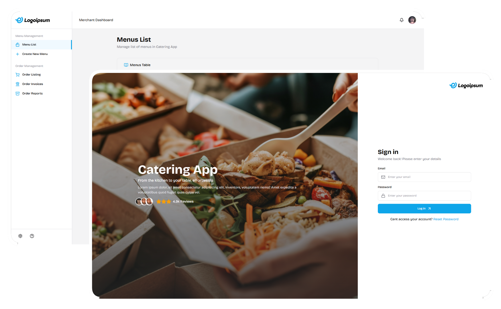

# CateringApp

A merchant discovery and catering order platform. Customers find nearby merchants on a map, browse their menus, and place orders. Merchants manage their listings, menus, and orders from a shared dashboard.

The project is still a work in progress.



### Stack

- **Laravel** with **Laravel Breeze** for authentication
- **Alpine.js** for frontend interactivity
- **Tailwind CSS v3** for styling
- **Leaflet** + **Leaflet.markercluster** for merchant map discovery
- **SQLite** for local development
- Custom UI component library


## Getting Started

Clone the repo and install dependencies:

```bash
git clone https://github.com/your-username/catering-app.git
cd catering-app

composer install
npm install
```

Copy the environment file and generate the app key:

```bash
cp .env.example .env
php artisan key:generate
```

SQLite is already configured as the default database. Run migrations and seed the database:

```bash
php artisan migrate --seed
```

The seeders and factories will populate everything — no external SQL file needed.

Start the dev server:

```bash
npm run dev
php artisan serve
```


## Progress

**Core**
- [x] Role-based auth via Laravel Breeze — Merchant and Customer roles
- [x] Merchant and Customer profile management
- [x] Menu CRUD for merchants
- [x] Merchant map discovery, filterable by distance from customer location
- [ ] Order and OrderItem models
- [ ] Invoice generation

**Additional**
- [ ] Slider gallery view for menus
- [ ] Data export via batch jobs

**Nice to have**
- [ ] Payment gateway integration


## Note

The code in this repository is hand-written. AI was only used to help with text content and documentation.


## License

MIT
